# Assignment 1 - Web Services

## Python version: 

* Python 3.11.5

## Modules to install: 

* for Fast API: ```fastapi```, ```pydantic```, ```spacy```
* for Flask: ```flask```, ```ner```, ```spacy```
* for Streamlit: ```networkx```, ```graphviz```, ```PIL```, ```streamlit```, ```pandas```, ```altair```

## How to start the apps: 

* all of these require cd into ```./assignment1/code/```
* since I am on Windows, I ran all of these out of Powershell

## RESTFull API: 

### **Loading the app:** 

* ```uvicorn app_fastapi:app --reload```: http://127.0.0.1:8000 should open up in the web browser but we will interact with the API through the command line to receive outputs for the file ```input.json``` (you can change the content of this file to parse a different text input).

* in the same directory, run these commands: 

### **Without ```pretty``` parameter:**

**For Windows:** Run these commands in either Powershell or Command Prompt and see the results in the terminal

- for general info: ```curl http://127.0.0.1:8000```

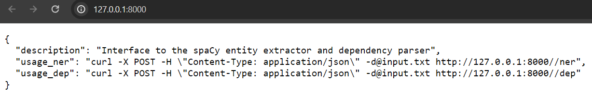


- for named entity recognition (NER): ```Invoke-RestMethod -Uri http://127.0.0.1:8000/ner -Method Post -Headers @{"Content-Type"="application/json"} -InFile input.json | ConvertTo-Json -Depth 100 | Out-Host```

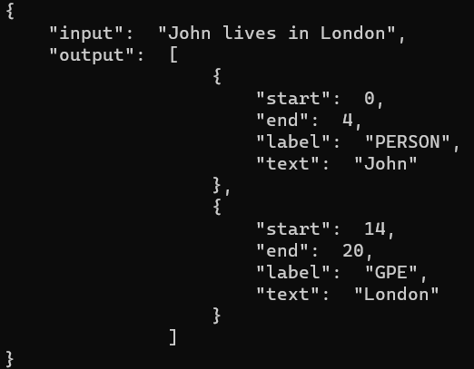

- for dependencies (DEP): ```Invoke-RestMethod -Uri http://127.0.0.1:8000/dep -Method Post -Headers @{ "Content-Type"="application/json" } -InFile input.json | ConvertTo-Json -Depth 100 | Out-Host```

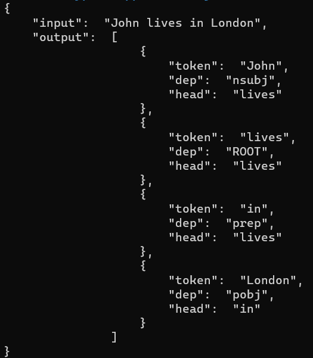


**For Linux/Mac:** 

- general info: ```curl http://127.0.0.1:8000```

- NER: ```curl http://127.0.0.1:8000/ner -H "Content-Type: application/json" -d@input.txt```

- DEP: ```curl http://127.0.0.1:8000/dep -H "Content-Type: application/json" -d@input.txt```


### **With ```pretty``` parameter:**

**For Windows:**

- for general info: ```curl http://127.0.0.1:8000?pretty=true```

- for NER: ```Invoke-RestMethod -Uri http://127.0.0.1:8000/ner?pretty=true -Method Post -Headers @{"Content-Type"="application/json"} -InFile input.json | ConvertTo-Json -Depth 100 | Out-Host```

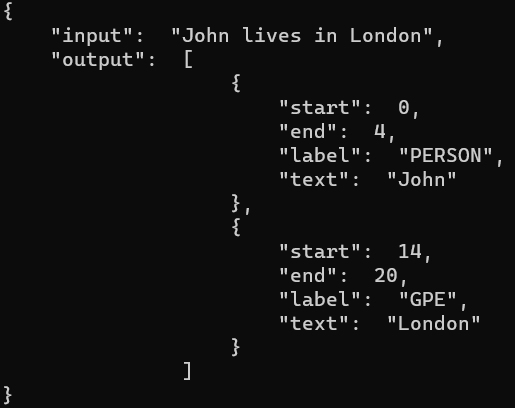


- for DEP: ```Invoke-RestMethod -Uri http://127.0.0.1:8000/dep?pretty=true -Method Post -Headers @{ "Content-Type"="application/json" } -InFile input.json | ConvertTo-Json -Depth 100 | Out-Host```

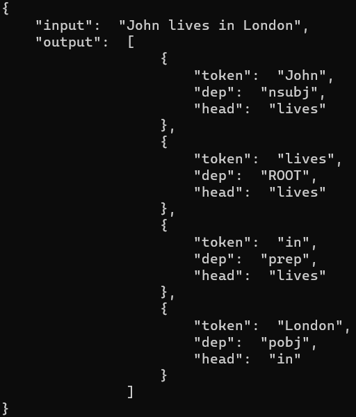


**For Linux/Mac:**

- for general info: ```curl http://127.0.0.1:8000?pretty=true```

- for NER: ```curl http://127.0.0.1:8000/ner?pretty=true -H "Content-Type: application/json" -d@input.json```

- for DEP: ```curl http://127.0.0.1:8000/dep?pretty=true -H "Content-Type: application/json" -d@input.json```

## Flask Webserver: 

### Loading the app: 

* ```python app_flask.py```

* open http://127.0.0.1:5000/ in browser

### App interface: 

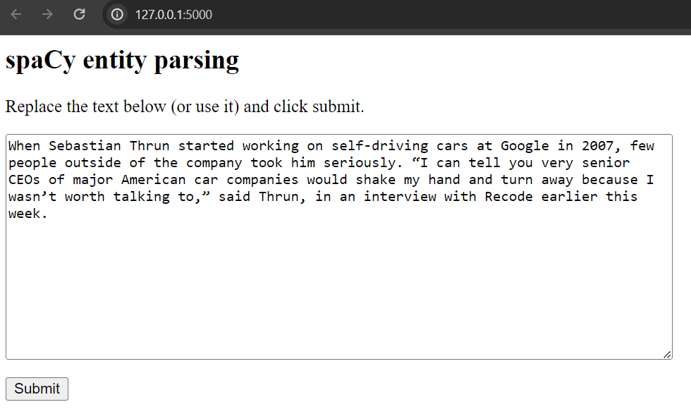

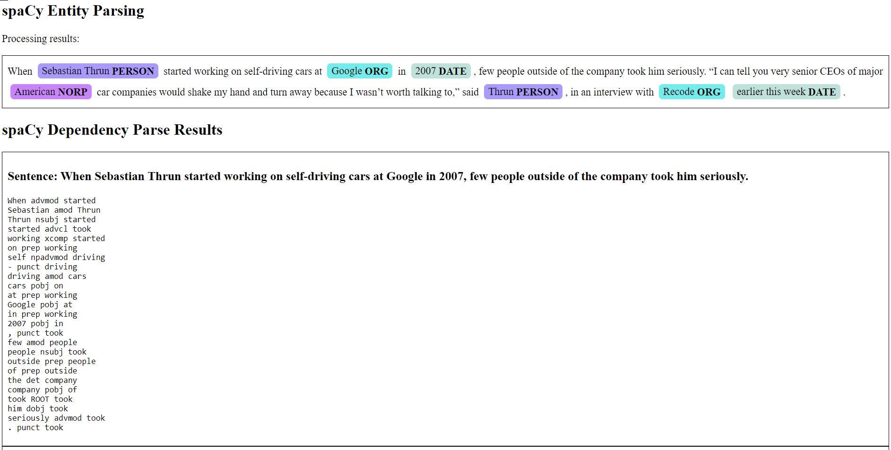

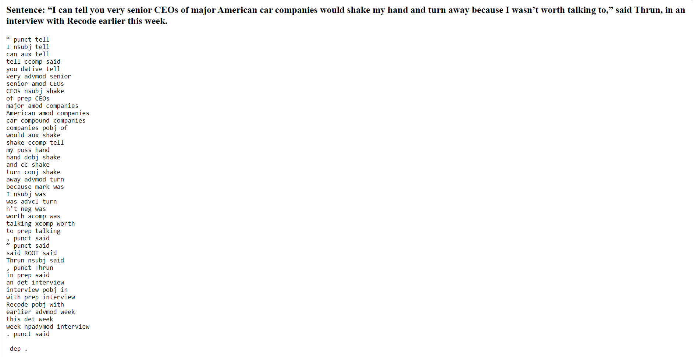


## Streamlit app: 

### Loading the app: 

* ```streamlit run app_streamlit.py```

* open http://localhost:8501/ in browser if not automatically launched

* you can change the default input text by changing the content of ```input.txt```

### App interface: 

#### **Entities View:**

##### **Entities Tab:**

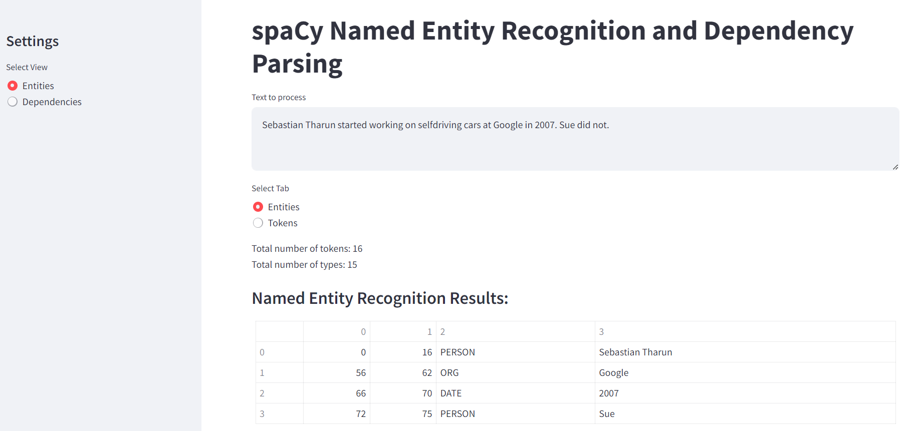


##### **Tokens Tab:**

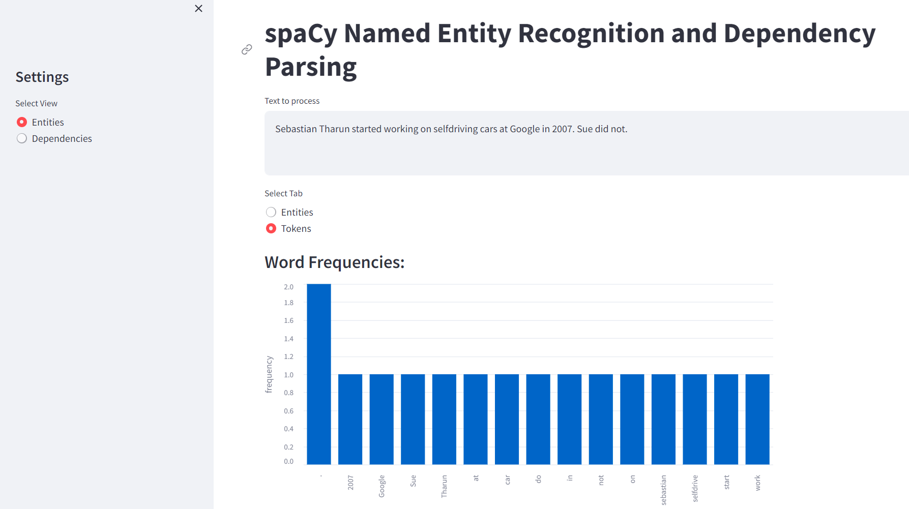


#### **Dependencies View:**

##### **Table Tab:**

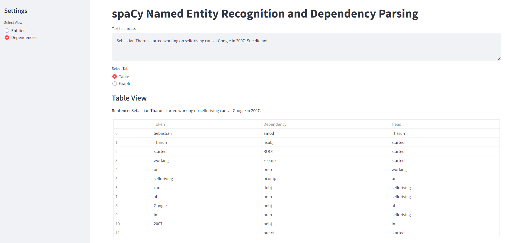


##### **Graph Tab:**

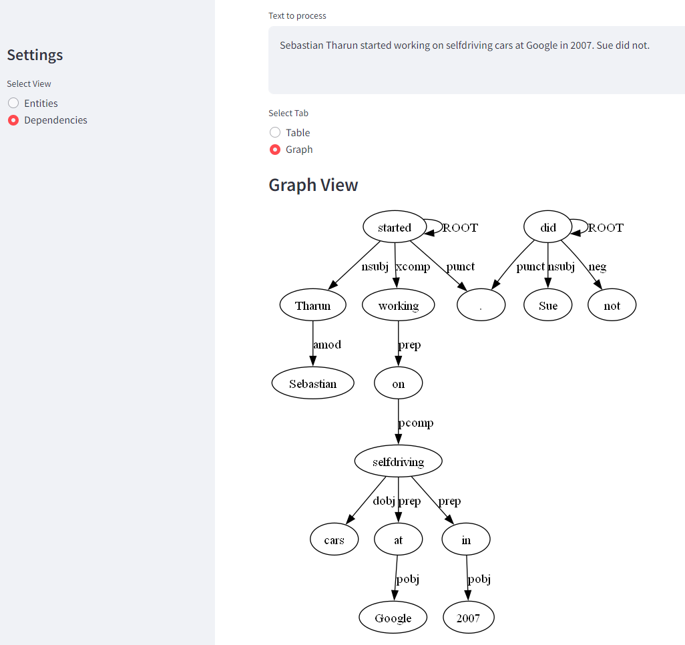

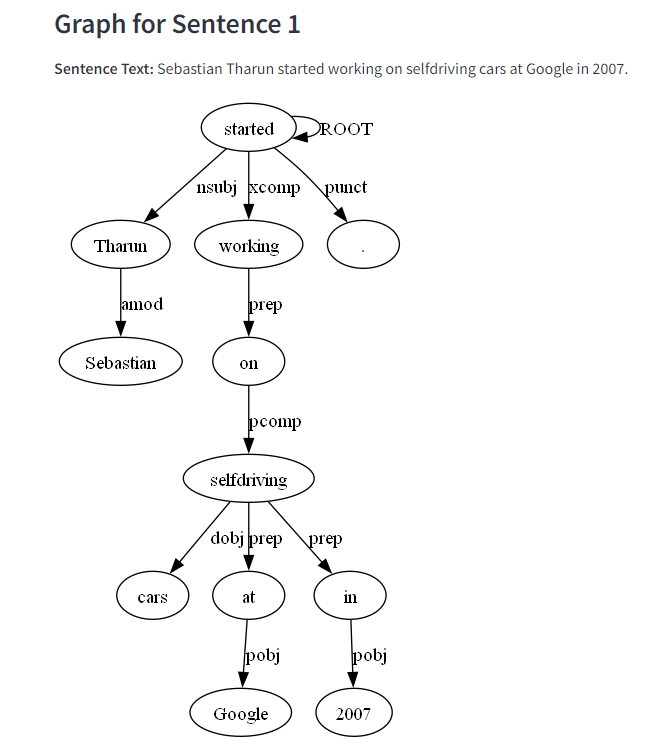
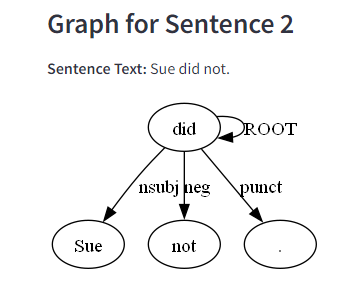


