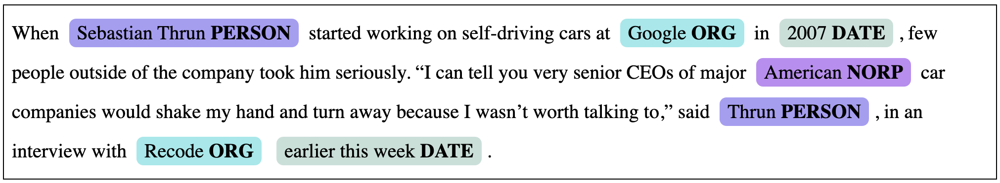
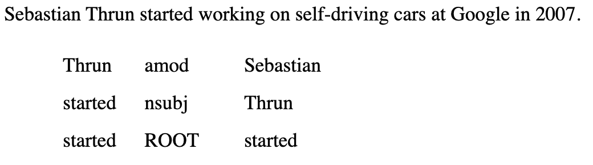
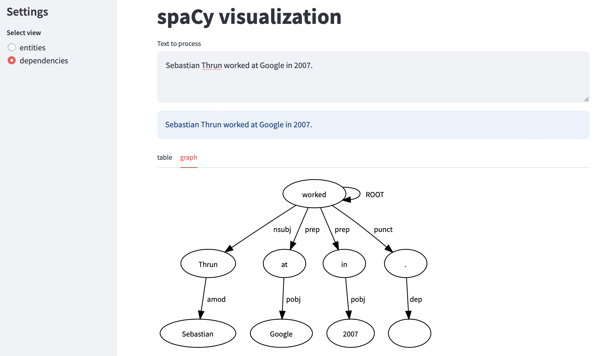
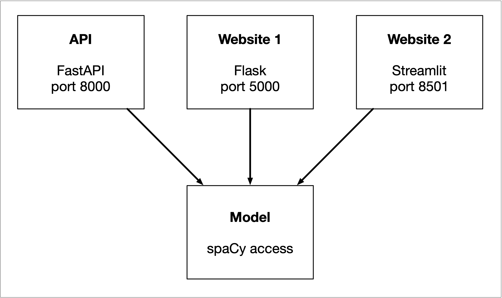

# Assignment 1 - Web Services

## Python version: 

* Python 3.11.5

## Modules to install: 

* for Fast API: ```fastapi```, ```pydantic```, ```spacy```
* for Flask: ```flask```, ```ner```, ```spacy```
* for Streamlit: ```networkx```, ```graphviz```, ```PIL```, ```streamlit```, ```pandas```, ```altair```

## How to start the apps: 

* all of these require cd into ```./assignment1/code/```
* since I am on Windows, I ran all of these out of Powershell

#### RESTFull API: 

* ```uvicorn app_fastapi:app --reload```: http://127.0.0.1:8000 should open up in the web browser but we will interact with the API through the command line to receive outputs for the file ```input.json``` (you can change the content of this file to parse a different text input).

* in the same directory, run these commands: 

**Without ```pretty``` parameter:**

- for general info: ```curl http://127.0.0.1:8000```

- for named entity recognition (NER): ```Invoke-RestMethod -Uri http://127.0.0.1:8000/ner -Method Post -Headers @{"Content-Type"="application/json"} -InFile input.json | ConvertTo-Json -Depth 100 | Out-Host``` (on Linux or Mac, you might be able to run ```curl http://127.0.0.1:8000/ner -H "Content-Type: application/json" -d@input.txt```)

- for dependencies (DEP): ```Invoke-RestMethod -Uri http://127.0.0.1:8000/dep -Method Post -Headers @{ "Content-Type"="application/json" } -InFile input.json | ConvertTo-Json -Depth 100 | Out-Host``` (on Linux or Mac, you might be able to run ```curl http://127.0.0.1:8000/dep -H "Content-Type: application/json" -d@input.txt```)

**With ```pretty``` parameter:**

- for general info: ```curl http://127.0.0.1:8000?pretty=true```

- for NER: ```Invoke-RestMethod -Uri http://127.0.0.1:8000/ner?pretty=true -Method Post -Headers @{"Content-Type"="application/json"} -InFile input.json | ConvertTo-Json -Depth 100 | Out-Host``` (on Linux or Mac: ```curl http://127.0.0.1:8000/ner?pretty=true -H "Content-Type: application/json" -d@input.json```)

- for DEP: ```Invoke-RestMethod -Uri http://127.0.0.1:8000/dep?pretty=true -Method Post -Headers @{ "Content-Type"="application/json" } -InFile input.json | ConvertTo-Json -Depth 100 | Out-Host``` (on Linux or Mac: ```curl http://127.0.0.1:8000/dep?pretty=true -H "Content-Type: application/json" -d@input.json```)


There old assignment had three parts:

1. Create a RESTful API to access spaCy NER
2. Create a Flask webserver to access spacy NER
3. Create a Streamlit application to access spacy

Due to a problem between my head and the keyboard, the example solution is now the sample code to start from. You may totally ignore the sample code, but since it does do many of the things you need, you may want to take chunks from it.

The assignment is now reframed as follows:

1. Create a RESTful API to access spaCy NER and spaCy dependency parsing
2. Create a Flask webserver to access spacy NER  and spaCy dependency parsing
3. Create a Streamlit application to access and spaCy dependency parsing


### RESTful API with FastAPI

The sample code responds to both a GET and a POST request at the same URL:

```bash
$ curl http://127.0.0.1:8000
$ curl http://127.0.0.1:8000 -H "Content-Type: application/json" -d@input.txt
```

The GET request was to return something informative about the service and the post request the result of processing, basically a list of entities with the start and end offset, the label and the text. In both cases what came back was JSON.

For the new assignment we want to use three URLs:

```bash
$ curl http://127.0.0.1:8000
$ curl http://127.0.0.1:8000/ner -H "Content-Type: application/json" -d@input.txt
$ curl http://127.0.0.1:8000/dep -H "Content-Type: application/json" -d@input.txt
```

The first returns a short description, the second the named entities, and the third the dependencies.

Your API should also accept a pretty parameter:

```bash
$ curl http://127.0.0.1:8000?pretty=true
$ curl http://127.0.0.1:8000/ner?pretty=true -H "Content-Type: application/json" -d@input.json
$ curl http://127.0.0.1:8000/dep?pretty=true -H "Content-Type: application/json" -d@input.json
```


### Flask webserver

The sample code implements a Flask webserver that provides two pages: one that presents a form that you can use to send a request to spaCy and one that shows the result.

All the user needs to do to access the website is to point a browser at [http://127.0.0.1:5000](http://127.0.0.1:5000). After you send a request you should see something like this for the named entity part:

> 

For the new assignment you should also present the results of the dependency parse and for each sentence you should see something like:

> 


### Streamlit

The sample code implements a small Streamlit application that you can access at [http://localhost:8501/](http://localhost:8501/). It shows the result of spaCy NER in a table and a bar chart of word frequencies.

You need to add some code that shows the result of the dependency parser for each sentence, both in a table and as a graph.

> 


The main goal here is to play around with Streamlit a bit.


### Code design

You want to make sure that the main parts of code are clearly separated.



You need to organize your code so that the API and websites are independent and only depend on the model. And the model should not have any knowledge of the three interfaces. 


### Wat to hand in?

You should hand in a link to a Git repository. That repository will be also used for future assignments. There should be a top-level directory `assignment1` which should have a `README.md` file that explains exactly what to do to run your code. This should include:

- The required Python version. Just list what you ran it on, no need to test on other versions of Python. I hope you are all at least on Python 3.8.
- What modules need to be installed.
- How to start the RESTFull API, the Flask webserver and the Streamlit application.
- How use the API or what URL to load.


### How will this be graded?

Pretty leniently. It should run of course and it should be easy to use. Clear understandable code is a definitely a plus.


