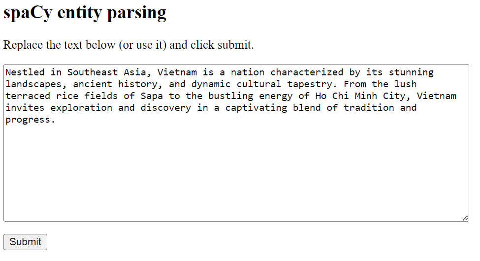
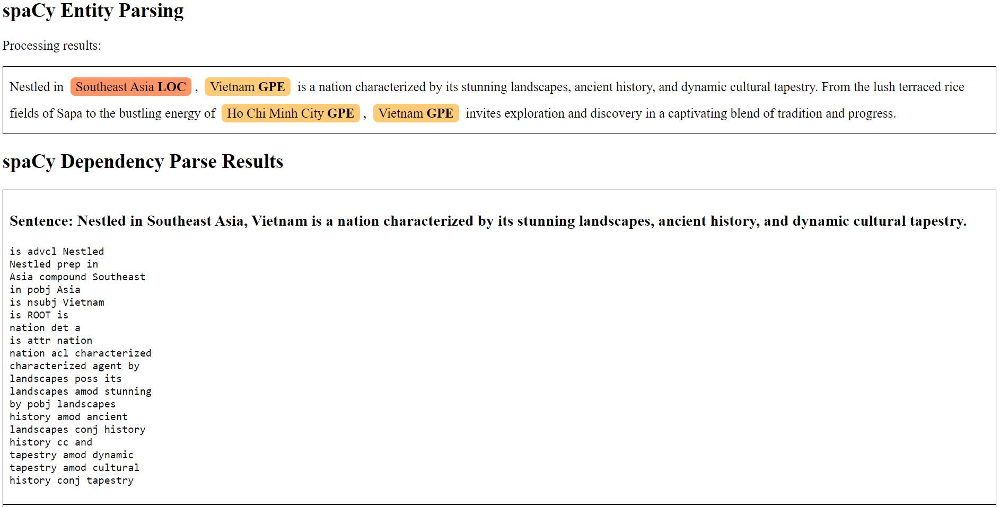
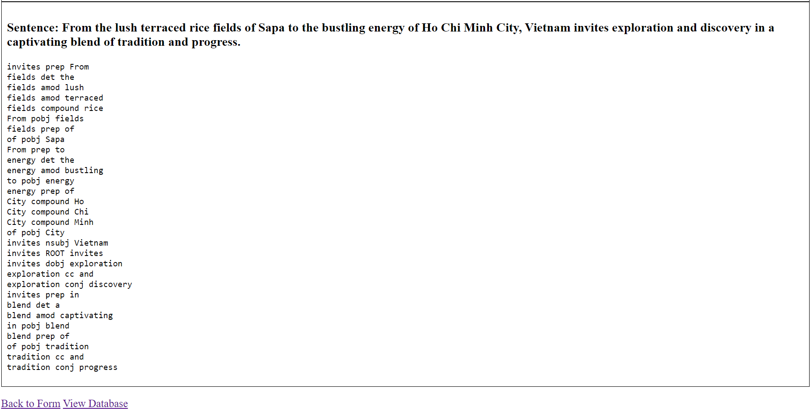
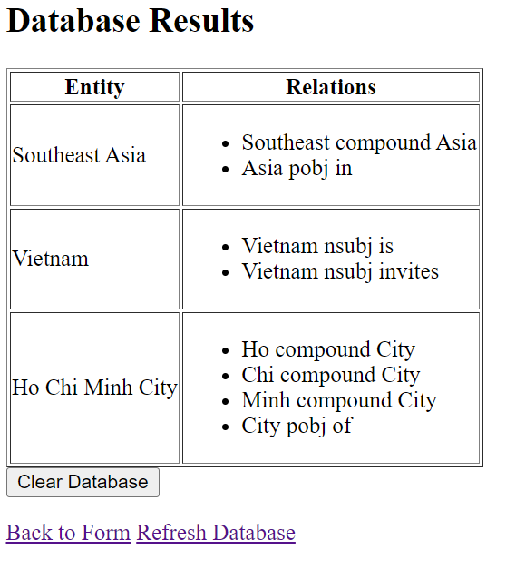
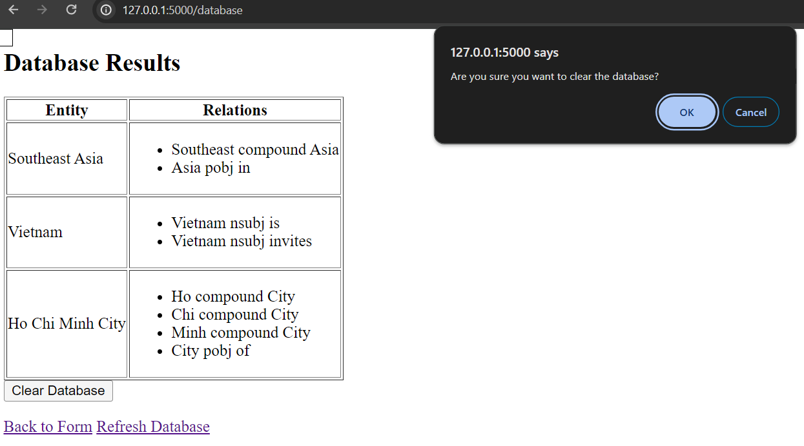

# Assignment 2 - Flask SQLAlchemy

## Python version: 

* ```Python 3.11.5```

## Modules to install: 

* ```flask```, ```ner```, ```spacy```, ```flask_sqlalchemy```, ```bs4```

## How to start and use the Flask web server: 

*  ```cd ./assignment2/code/```
* Run ```python app_flask.py```
* Navigate to http://127.0.0.1:5000
* Submit the pre-filled text or enter your own text
* You will be redirected to the spaCy Entity Parsing results page
* The database can be accessed from the results page, or  at http://127.0.0.1:5000/database

## Web server demo: 

### **Landing page:** http://127.0.0.1:5000

<kbd></kbd>

### **Results page:**

<kbd></kbd>
<kbd></kbd>

### **Database:** http://127.0.0.1:5000/database

<kbd></kbd>

* There's also the option to clear the database in case you want to submit a new text and do not want to keep the results of spaCy parsing of the previous input: 

<kbd></kbd>

