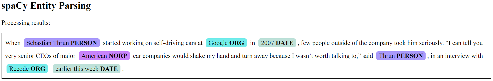
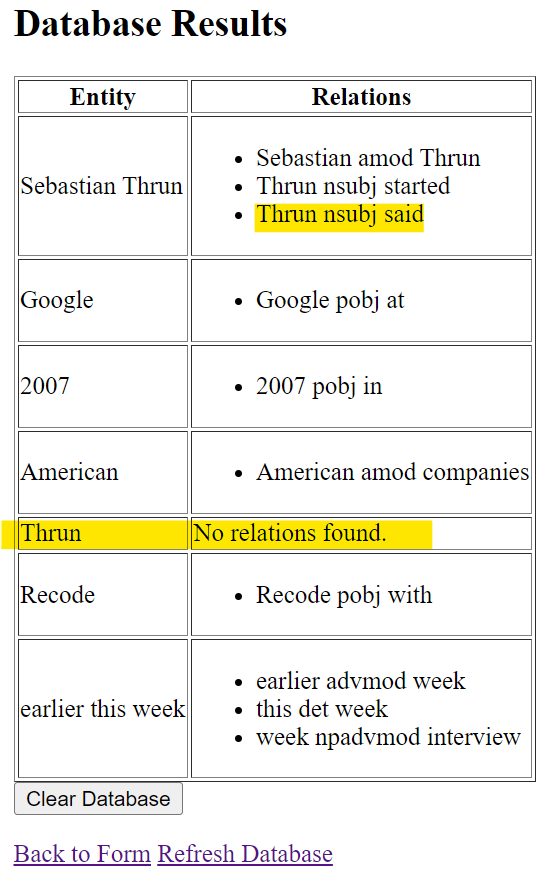

# Assignment 2 - Flask SQLAlchemy

## Python version: 

* ```Python 3.11.5```

## Modules to install: 

* ```flask```, ```ner```, ```spacy```, ```flask_sqlalchemy```, ```bs4```

## How to start and use the Flask web server: 

*  ```cd ./assignment2/code/```
* Run ```python app_flask.py```
* Navigate to http://127.0.0.1:5000
* Submit the pre-filled text or enter your own text
* You will be redirected to the spaCy Entity Parsing results page
* The database can be accessed from the results page, or  at http://127.0.0.1:5000/database

## Web server demo: 

### **Landing page:** http://127.0.0.1:5000

<kbd></kbd>

### **Results page:**

<kbd></kbd>
<kbd></kbd>

### **Database:** http://127.0.0.1:5000/database

<kbd></kbd>

* There's also the option to clear the database in case you want to submit a new text and do not want to keep the results of spaCy parsing of the previous input: 

<kbd></kbd>


### Future work: 

Currently, this Flask app has one shortcoming. Consider this example input text: "When Sebastian Thrun started working on self-driving cars at Google in 2007, few people outside of the company took him seriously. “I can tell you very senior CEOs of major American car companies would shake my hand and turn away because I wasn’t worth talking to,” said Thrun, in an interview with Recode earlier this week." 

The spaCy parsing results are as follows: 

<kbd></kbd>

We can see that there are 2 similar entities: "Sebastian Thrun" and "Thrun" which both point to the same entity (same person) in this case (although this might not be the case for all examples, e.g. Mr. Le and Mrs. Le are different people with the same last name). 

With the way that I currently set up this app so that I can collect all relations of an entity under one same row in the database, it's leading to the problem that all relations that "Thrun" appeared in will be collected under "Sebastian Thrun" (i.e. relation "Thrun said" in this case). Hence, even though in the database, "Thrun" appears as "No relations found", we can actually find the relation "Thrun said" under "Sebastian Thrun". Of course, this works only when these point to the same entity. 

<kbd></kbd>

For future work, I want to figure out a way to clearly separate entities that overlap each other (i.e., one entity is the substring of the other entity) such as the above example. 
