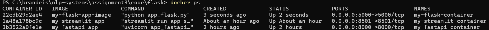

# Assignment 3 - Docker

## I. Prerequisites: 

### Python version: 

* ```Python 3.11.5```

### Docker: 

#### Docker Desktop:

* In order to run Docker commands, you will need to install the Docker Engine and the Docker CLI (Command Line Interface). 

* The approach I personally used and would recommend is to install Docker Desktop: 

    * **Windows**: [Docker Desktop for Windows](https://docs.docker.com/desktop/install/windows-install/).

    * **macOS**: [Docker Desktop for Mac](https://docs.docker.com/desktop/install/mac-install/).

    * **Linux, Ubuntu**: [Install Docker Desktop on Linux](https://docs.docker.com/desktop/install/linux-install/) and [Install Docker Engine on Ubuntu](https://docs.docker.com/engine/install/ubuntu/)

* **Prior to running Docker commands, building and running containers, you must first open Docker Desktop**. Docker Desktop includes both the Docker Engine (the Docker daemon) and the Docker CLI (Command Line Interface). When you start Docker Desktop, it initializes the Docker daemon in the background, allowing you to interact with it using the Docker CLI in your terminal or command prompt.


#### Docker Extension in VSCode: 

* You might also want to look into installing the [Docker Extension in VSCode](https://code.visualstudio.com/docs/containers/overview). This does not replace Docker Desktop but rather complements it, making it easy to build, manage, and deploy containerized applications in Visual Studio Code.

## II. FastAPI App: 

* To build and run the docker container, first `cd ./code/fastapi`

* To build the Docker image from the Dockerfile:

    ```
    docker build -t my-fastapi-app .
    ```

* To create and start a Docker container based on the Docker image built above: 

    ```
    docker run -d -p 8000:8000 --name my-fastapi-container my-fastapi-app
    ```

* Then navigate to http://127.0.0.1:8000/ to see the launched app. We will however interact with spaCy through the command line: 

    * For general info: 

        ```
        curl http://127.0.0.1:8000
        ```

    * **NER parsing** (you can change the text you want to parse by editing the file `./code/fastapi/input.json` and `./code/fastapi/input.txt`):

        * for Windows:

        ```
        Invoke-RestMethod -Uri http://127.0.0.1:8000/ner -Method Post -Headers @{"Content-Type"="application/json"} -InFile input.json | ConvertTo-Json -Depth 100 | Out-Host
        ```

        * for Mac/Linux: 

        ```
        curl http://127.0.0.1:8000/ner -H "Content-Type: application/json" -d@input.txt
        ```

    * **DEP**: 

        * for Windows:

        ```
        Invoke-RestMethod -Uri http://127.0.0.1:8000/dep -Method Post -Headers @{ "Content-Type"="application/json" } -InFile input.json | ConvertTo-Json -Depth 100 | Out-Host
        ```

        * for Mac/Linux: 

        ```
        curl http://127.0.0.1:8000/dep -H "Content-Type: application/json" -d@input.txt
        ```


## III. Flask App:

* To build and run the docker container, first `cd ./code/flask`

* To build the Docker image from the Dockerfile:

    ```
    docker build -t my-flask-app-image .
    ```

* To create and start a Docker container based on the Docker image built above: 

    ```
    docker run -d -p 5000:5000 --name my-flask-container my-flask-app-image
    ```

* Navigate to: http://127.0.0.1:5000/ to access the app

## IV. Streamlit App: 

* To build and run the docker container, first `cd ./code/streamlit`

* To build the Docker image from the Dockerfile:

    ```
    docker build -t my-streamlit-app .
    ```

* To create and start a Docker container based on the Docker image built above: 

    ```
    docker run -d -p 8501:8501 --name my-streamlit-container my-streamlit-app
    ```

* Navigate to: http://localhost:8501/ to access the app


## V. Troubleshooting: 

* In case you cannot build your image or run your Docker container, first check if your container is running: 

    ```
    docker ps 
    ```

    * If you successfully built and ran all the containers above, you should see active docker containers for the 3 apps when running `docker ps`: 

    <kbd></kbd>

* If you cannot see your container in the list of active containers above, check its status by running the below command. If the status is "EXIT", this means there was an error while building your Docker image.

    ```
    docker ps -a
    ```

* Check the logs for full details on the error: 

    ```
    docker logs container-id
    ```

* In this case, you can choose to stop and remove the container, debug, then build and run the container again. 

    * To stop the container, first locate its ID by printing all active containers through the command line: 

        ```
        docker ps
        ```

    * Locate the ID of the container you want to stop and/or remove (note that you must stop a container before you can remove it), then: 

        ```
        docker stop container-id
        docker rm container-id
        ```

## To-do: 

* pep-8
* check package versions in `requirements.txt` files
